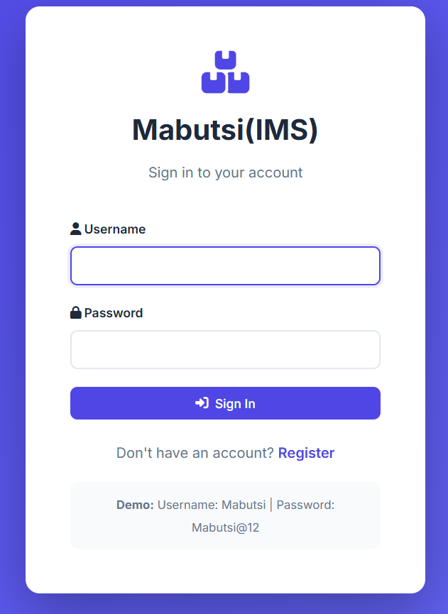
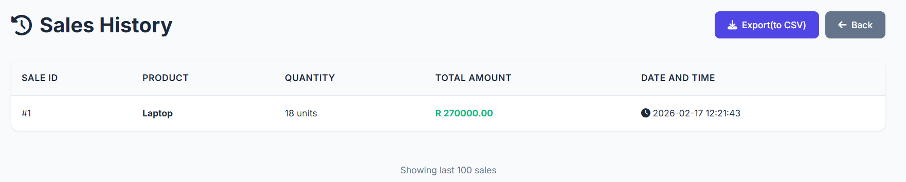
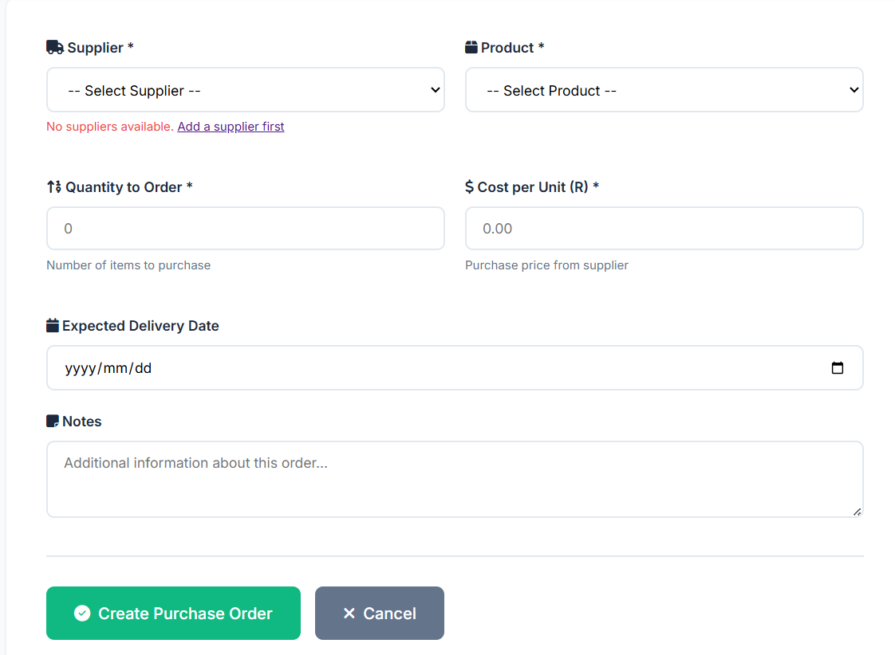
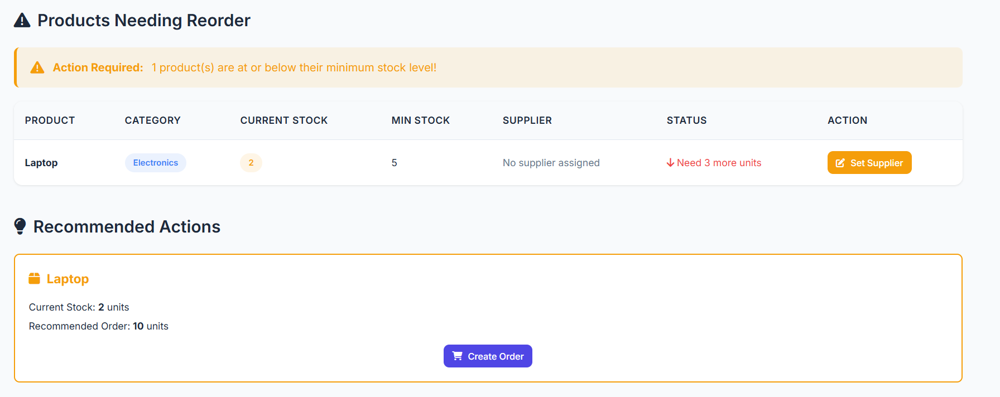
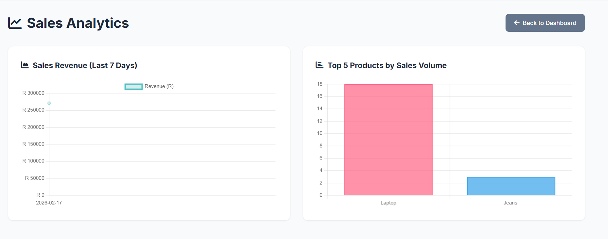

# 📦 inventory_app

> A full-featured inventory management system built with Python and Flask. Manage products, track sales, handle suppliers, create purchase orders, and monitor stock levels — all from one clean dashboard.

---

## 📸 Screenshots

### 👥 Login


### 🏠 Dashboard


### ➕ Add Product


### 🛒 New Sale


### 📜 Sales History


### 🚚 Suppliers


### 📋 Purchase Orders


### 🔔 Stock Alerts


### 📊 Analytics


---

## ✨ Features

- 🔐 **User Authentication** — Login, register, change password
- 📊 **Live Dashboard** — Total products, revenue, profit, and today's performance
- 📦 **Product Management** — Add, edit, delete products with categories and barcodes
- 🛒 **Sales Recording** — Record sales with automatic stock deduction
- 🚚 **Suppliers** — Store supplier contact details and link them to products
- 📋 **Purchase Orders** — Create orders, track status, auto-update stock on receipt
- 🔔 **Stock Alerts** — Automatic low-stock warnings with reorder recommendations
- 📈 **Analytics** — 7-day revenue chart and top 5 products chart
- 💾 **CSV Export** — Export inventory and sales reports
- 🌍 **South African Time (SAST)** — All timestamps in UTC+2
- 📱 **Responsive Design** — Works on mobile, tablet, and desktop

---

## 🛠️ Built With

| Technology | Purpose |
|-----------|---------|
| Python 3 | Backend language |
| Flask | Web framework |
| SQLite | Database |
| Werkzeug | Password hashing |
| Chart.js | Analytics charts |
| Font Awesome | Icons |
| Google Fonts (Inter) | Typography |
| HTML5 + CSS3 | Frontend |
| JavaScript | Client-side logic |

---

## 🗄️ Database Structure

Six tables working together:

```
products        — name, cost, price, stock, min_stock, category, barcode, supplier
sales           — product, quantity, total, timestamp
users           — username, hashed password, role
suppliers       — name, contact person, email, phone, address
purchase_orders — supplier, product, quantity, cost, status, dates
stock_alerts    — product, threshold, active status
```

---

## 📂 Project Structure

```
inventory_app/
├── app.py                    # Main Flask application (all routes and logic)
├── init_database.py          # Run once to create database tables
├── requirements.txt          # Python dependencies
├── run.bat                   # Windows one-click start
│
├── templates/                # HTML pages (16 files)
│   ├── base.html             # Navigation and layout shared by all pages
│   ├── login.html
│   ├── register.html
│   ├── change_password.html
│   ├── index.html            # Dashboard
│   ├── add_product.html
│   ├── edit_product.html
│   ├── sales.html
│   ├── sales_history.html
│   ├── analytics.html
│   ├── suppliers.html
│   ├── add_supplier.html
│   ├── edit_supplier.html
│   ├── purchase_orders.html
│   ├── create_purchase_order.html
│   └── stock_alerts.html
│
├── static/
│   └── style.css             # All styling (responsive, 850+ lines)
│
└── screenshots/              # Images used in this README
```

---

## 🚀 Getting Started

### Requirements
- Python 3.8 or higher
- pip

### Installation

**1. Clone the repository**
```bash
git clone https://github.com/Kgaogelo02/inventory_app.git
cd inventory_app
```

**2. Install dependencies**
```bash
pip install -r requirements.txt
```

**3. Initialize the database**
```bash
python init_database.py
```

**4. Run the application**
```bash
python app.py
```

**5. Open in browser**
```
http://127.0.0.1:5000
```

**6. Login with default credentials**
```
Username: Mabutsi
Password: Mabutsi@12

---

## 🔐 Security

- Passwords hashed with **Werkzeug PBKDF2 SHA256** — never stored in plain text
- **Session-based authentication** with Flask secure sessions
- All routes protected with `@login_required` decorator
- **Parameterized SQL queries** — no SQL injection possible
- Server-side input validation on all forms

---

## 📱 Responsive Design

| Screen Size | Layout |
|------------|--------|
| Desktop (>1024px) | Full layout, 4-column stats grid |
| Tablet (768–1024px) | Adjusted spacing, 2-column grids |
| Mobile (<768px) | Single column, scrollable navigation |

---

## 📊 Pages Overview

| Page | URL | What It Does |
|------|-----|-------------|
| Dashboard | `/` | Stats, product table, top sellers |
| Add Product | `/add_product` | Form to add new product |
| Edit Product | `/edit_product/<id>` | Update existing product |
| New Sale | `/add_sale` | Record a customer sale |
| Sales History | `/sales_history` | All past transactions |
| Analytics | `/analytics` | Revenue and product charts |
| Suppliers | `/suppliers` | Supplier directory |
| Add Supplier | `/add_supplier` | Add new supplier |
| Purchase Orders | `/purchase_orders` | All purchase orders |
| Create PO | `/create_purchase_order` | New purchase order form |
| Stock Alerts | `/stock_alerts` | Low stock products |
| Change Password | `/change_password` | Update login password |

---

## ⚙️ Troubleshooting

**`no such table: users`**
```bash
python init_database.py
```

**`ModuleNotFoundError`**
```bash
pip install -r requirements.txt

---

*Built with Flask and Python*
